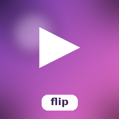
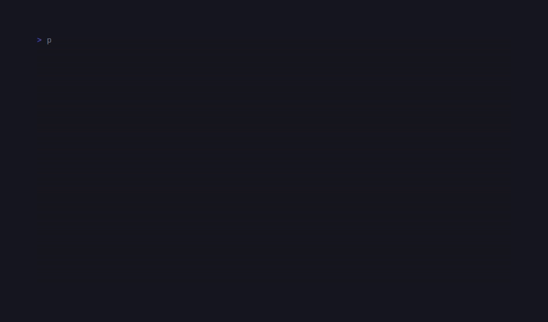

# CandyFlip

<!-- BADGES:BEGIN -->
[](https://github.com/detain/sugarcraft/actions/workflows/ci.yml)
[](https://app.codecov.io/gh/detain/sugarcraft?flags%5B0%5D=candy-flip)
[](https://packagist.org/packages/sugarcraft/candy-flip)
[](LICENSE)
[](https://www.php.net/)
<!-- BADGES:END -->




ASCII GIF viewer on the SugarCraft stack — port of [`namzug16/gifterm`](https://github.com/namzug16/gifterm). Decodes a `.gif` on disk via `ext-gd`, downsamples each frame to a configurable cell grid, and renders the animation into the terminal as 24-bit background-coloured cells (`solid` preset) or shaded Unicode glyphs from a luminance ramp (`density` preset) at a configurable framerate.

```bash
composer require sugarcraft/candy-flip
candy-flip my-animation.gif         # solid-block preset (default)
candy-flip my-animation.gif density # ASCII luminance ramp
```

## Keys

| Key                | Action                              |
|--------------------|-------------------------------------|
| `Space`            | Pause / resume                      |
| `←`                | Step back one frame                 |
| `→`                | Step forward one frame              |
| `d`                | Toggle solid ↔ density preset       |
| `q` / `Esc`        | Quit                                |

## Implementation notes

The decoder uses PHP's built-in `imagecreatefromstring()` for in-memory single-frame extraction — no temporary files are written to disk. It walks the GIF89a byte-stream manually to:

1. Parse the Logical Screen Descriptor and Global Color Table (GCT) from the header.
2. Walk the frame stream, extracting each frame's Graphic Control Extension (GCE) delay, disposal method (0–3), and transparent-color index.
3. Extract per-frame Local Color Table (LCT) when present; fall back to the GCT otherwise.
4. Reassemble a minimal single-frame GIF payload in memory and pass it to `imagecreatefromstring()`.
5. Area-average downsample the resulting `GdImage` to the requested cell grid, skipping transparent pixels in the average.

GIF parsing is hand-rolled to avoid loading the entire animation into a `GdImage` at once; each frame is decoded independently. The decoder caps at 256 frames, refuses logical screens larger than 2,000,000 pixels, and caps the output grid at 100,000 cells, so memory usage stays bounded for typical animations and for hostile headers alike.

## Architecture

| File              | Role                                                                                                  |
|-------------------|------------------------------------------------------------------------------------------------------|
| `Decoder`         | Reads the GIF, extracts per-frame GCE delay + disposal + transparency + local color table + image left/top offset, hands each frame to GD via `imagecreatefromstring()`, area-average downsamples the composited canvas to a cell grid, returns a list of {@see Frame}. Compositing handles DISPOSAL_NONE/KEEP (0/1) to leave the canvas, DISPOSAL_BACKGROUND (2) to clear the prior rect, and DISPOSAL_PREVIOUS (3) to restore a canvas snapshot. |
| `Frame`           | Pure value — 2-D RGB grid in cell coordinates with per-frame `$delay` (centiseconds), `$disposal` method (0–3), and `$transparent` flag. |
| `Renderer`        | ANSI emitter. Two presets: `solid` (24-bit background-coloured spaces) or `density` (luminance ramp). `withAdaptiveSize()` queries the TTY via `SizeIoctl` so the output never overflows the viewport; `withConstraints()` accepts explicit row/col limits for testing. |
| `Player`          | SugarCraft Model — index + paused + preset + renderer state. `Cmd::tick(...)` schedules frame advance using per-frame delays. Handles `WindowSizeMsg` by re-clamping the renderer to the new viewport (rows-1 for the status line). |
| `TickMsg`         | Frame-tick message produced by the Cmd.                                                            |

The decoder caps at 256 frames and at a 2,000,000-pixel logical screen so a runaway file — or a crafted header — can't OOM the runtime before the first frame is even composited; pause + manual step are always available even on long animations.

## Test

```bash
composer install
vendor/bin/phpunit
```

## Snapshot tests

Rendering output is pinned via `candy-testing`'s `assertGoldenAnsi` golden-file
snapshots. Any change to the ANSI cell output must be intentional — re-record the
fixture with `UPDATE_GOLDENS=1 vendor/bin/phpunit` to accept a new canonical render.
